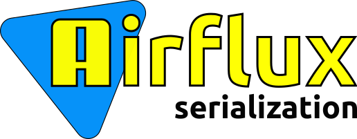

# The Airflux serialization library.


[](https://opensource.org/licenses/Apache-2.0)
[](https://sonarcloud.io/dashboard?id=airflux_airflux)
[](https://sonarcloud.io/dashboard?id=airflux_airflux)
[](https://sonarcloud.io/dashboard?id=airflux_airflux)
[](https://codecov.io/gh/airflux/airflux)
[](https://sonarcloud.io/dashboard?id=airflux_airflux)
[](https://www.codacy.com/gh/airflux/airflux/dashboard?utm_source=github.com&amp;utm_medium=referral&amp;utm_content=airflux/airflux&amp;utm_campaign=Badge_Grade)
[](https://bestpractices.coreinfrastructure.org/projects/5511)

[](https://jitpack.io/#airflux/airflux)

The library to parse, validate and generate data in the JSON (JavaScript Object Notation) format.

The documentation site: [https://airflux.github.io/airflux-serialization/](https://airflux.github.io/airflux-serialization/)

# Installation

```
repositories {
    ...
    maven {
        url = uri("https://jitpack.io")
    }
}

dependencies {
    implementation("com.github.airflux.airflux:airflux-serialization:v0.0.1-alpha.1")
    
    implementation("com.github.airflux.airflux:airflux-jackson-parser:v0.0.1-alpha.1")
    implementation("com.fasterxml.jackson.core:jackson-core:2.13.3")
    implementation("com.fasterxml.jackson.module:jackson-module-kotlin:2.13.3") {
        exclude(group = "org.jetbrains.kotlin")
    }
}
```

# Codecov graphs

[](https://codecov.io/gh/airflux/airflux-serialization/branch/main/graphs/sunburst.svg?token=QBD7092MJI)

# License

[](https://app.fossa.com/projects/git%2Bgithub.com%2Fairflux%2Fairflux?ref=badge_large)
