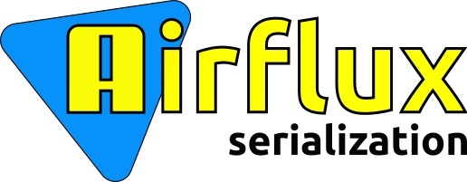

# Welcome to Airflux serialization

The library to parsing, validate and generate data in the JSON (JavaScript Object Notation) format.
The library doesn't use code generation or reflection.

**Documentation in progress.**